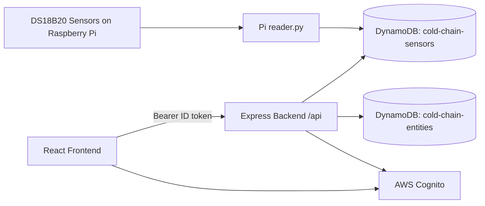

# Cold Chain Monitoring Platform

End-to-end cold-chain monitoring project with:

- A React + TypeScript dashboard for authenticated users
- A Node.js + Express + TypeScript API
- DynamoDB-backed storage for readings and entities
- A Raspberry Pi endpoint for DS18B20 sensor ingestion

## What Is In This Repository

This repository contains three active parts:

- frontend: web dashboard with AWS Cognito login/signup and temperature visualization
- backend: protected REST API using Cognito JWT verification
- Pi-endpoint: Python scripts that read 1-Wire sensors and write readings to DynamoDB

## High-Level Architecture



## Project Structure

```text
cold-chain/
   backend/
      src/
         controllers/        API handlers for temperature, sensors, devices, users
         db/                 DynamoDB client and query helpers
         middleware/         Cognito JWT authentication middleware
         routes/             Express route registration
         types/              Shared backend response/domain interfaces
         index.ts            Server bootstrap
         utils.ts            Error and 404 handlers

   frontend/
      src/
         components/         Dashboard UI components (cards, status bar, navbar)
         context/            Auth and theme context
         pages/              Login, signup, home, 404 pages
         store/              Redux store and async thunks for API calls
         config/             Amplify Cognito configuration
         utils/              authFetch wrapper adding Cognito ID token

   Pi-endpoint/
      reader.py             Reads DS18B20 sensors and writes DynamoDB records
      api_server.py         Optional local HTTP API that mirrors MQTT sensor updates
      requirements.txt      Python dependencies
```

## Tech Stack

- Frontend: React 18, TypeScript, Vite, Tailwind CSS, Redux Toolkit, Recharts, AWS Amplify Auth
- Backend: Node.js, Express, TypeScript, AWS SDK v3, aws-jwt-verify, Helmet, CORS
- Data: Amazon DynamoDB
- Edge endpoint: Python, boto3, python-dotenv

## Prerequisites

- Node.js 18+
- npm
- Python 3.10+
- AWS account with:
   - Cognito User Pool + App Client
   - DynamoDB tables for readings/entities
   - IAM credentials for local development and Pi runtime

## Local Setup

### 1) Install dependencies

```powershell
# backend
cd backend
npm install

# frontend
cd ../frontend
npm install

# Pi endpoint
cd ../Pi-endpoint
pip install -r requirements.txt
```

Note: api_server.py imports paho-mqtt. If you plan to run that script, install it:

```powershell
pip install paho-mqtt
```

### 2) Configure backend environment

Create backend/.env with values similar to:

```env
PORT=3001
NODE_ENV=development
FRONTEND_URL=http://localhost:5173

AWS_REGION=eu-north-1
DYNAMODB_READINGS_TABLE=cold-chain-sensors
DYNAMODB_ENTITIES_TABLE=cold-chain-entities

COGNITO_USER_POOL_ID=your_user_pool_id
COGNITO_CLIENT_ID=your_app_client_id
```

Important: frontend Vite proxy is configured to forward /api to http://localhost:3001.
If you use a different backend port, update frontend/vite.config.ts accordingly.

### 3) Configure frontend environment

Create frontend/.env with:

```env
VITE_COGNITO_USER_POOL_ID=your_user_pool_id
VITE_COGNITO_CLIENT_ID=your_app_client_id
```

### 4) Configure Pi endpoint environment

Create Pi-endpoint/.env with:

```env
TENANT_ID=pi-01
DYNAMODB_TABLE=cold-chain-sensors
AWS_REGION=eu-north-1
READ_INTERVAL=1800
```

### 5) Run development services

```powershell
# terminal 1
cd backend
npm run dev

# terminal 2
cd frontend
npm run dev
```

Frontend runs on http://localhost:5173 and proxies API requests from /api/* to backend.

Optional on a Raspberry Pi:

```powershell
cd Pi-endpoint
python reader.py
```

## Scripts

### backend

- npm run dev: start backend with hot reload (tsx watch)
- npm run build: compile TypeScript to dist
- npm run start: run compiled backend from dist/index.js
- npm run lint: lint backend source
- npm run typecheck: TypeScript no-emit type check

### frontend

- npm run dev: start Vite dev server
- npm run build: build production frontend
- npm run preview: preview production build
- npm run lint: lint frontend source
- npm run typecheck: TypeScript no-emit type check

## API Overview

All routes are mounted under /api and currently protected by JWT middleware.

### Temperature routes

- GET /api/temperature/latest
- GET /api/temperature/history?days=30&sensorId=optional
- POST /api/temperature
- DELETE /api/temperature/:sensorId/:timestamp

### Sensor routes

- GET /api/sensors
- POST /api/sensors
- GET /api/sensors/:id
- PUT /api/sensors/:id
- DELETE /api/sensors/:id

### Device routes

- GET /api/devices
- POST /api/devices
- GET /api/devices/:id
- PUT /api/devices/:id
- DELETE /api/devices/:id
- GET /api/devices/:deviceId/sensors

### User routes

- POST /api/users
- GET /api/users/:id
- PUT /api/users/:id
- DELETE /api/users/:id
- GET /api/users/:userId/devices

## DynamoDB Data Model

### Readings table

Expected default: cold-chain-sensors

- Partition key: sensorId
- Sort key: timestamp (ISO-8601)
- Additional fields: tenantId, sensorType, measure, value, fahrenheit, status, ttl

### Entities table

Expected default: cold-chain-entities

- Single-table style keying via PK and SK
- Example records:
   - DEVICE#<id> / PROFILE
   - SENSOR#<id> / PROFILE
   - USER#<id> / PROFILE
   - USER#<id> / DEVICE#<id> (mapping)
   - DEVICE#<id> / SENSOR#<id> (mapping)

## Current Status And Roadmap

Implemented today:

- Cognito-backed auth flow in frontend
- JWT-protected backend API
- Sensor dashboards with latest values and 24h trend visualization
- Device rename action from the dashboard

Planned next (from project TODO):

- Unit management enhancements (edit/delete)
- Real-time updates via AWS IoT Core
- Expanded card popup with larger graph and 30-day options
- History export/share options
- Status bar filtering interactions
- Deployment target on AWS EC2

## Troubleshooting

- 401 Unauthorized on API calls:
   - Confirm Cognito userPoolId/clientId match in backend and frontend env files
   - Confirm frontend is signed in and sends Authorization bearer token
- Frontend loads but API fails:
   - Check backend is running
   - Check backend port matches frontend Vite proxy target
- No sensor data in dashboard:
   - Verify cold-chain-sensors table has recent readings
   - Verify Pi reader.py has AWS credentials and correct table/region

